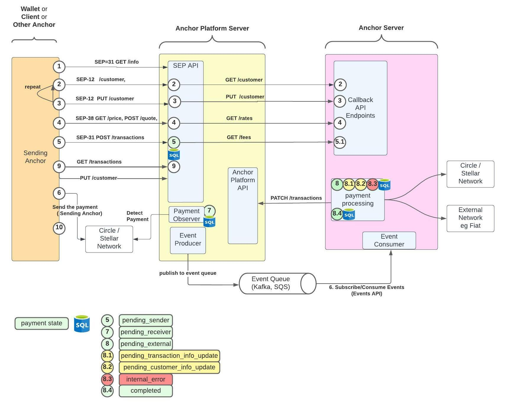

# Anchor Platform 101

- [Anchor Platform 101](#anchor-platform-101)
  - [Glossary](#glossary)
  - [Microservices](#microservices)
  - [Architecture](#architecture)
  - [Configuration](#configuration)

The Anchor Platform is a web application whose goal is to facilitate Anchor
integration with the Stellar network in an interoperable way, compiant with the
[SEP (Stellar Ecosystem Protocols)](https://github.com/stellar/stellar-protocol/tree/master/ecosystem).

The Anchor Platform will be exposing public endpoints and APIs that provide
functionalities described in the [SEPs] while abstracting most of the business
logic necessarry to enable interoperability with the Stellar network.

This way, Anchors willing to integrate with Stellar can use the Anchor Platform
to speed up their development process, allowing them to focus mainly on the
business logic that's specific to their businesses and use cases.

## Glossary

Here are the important terminology used in this project:

- **Anchor**: on/off ramps of the Stellar network. More information is available [here](https://developers.stellar.org/docs/anchoring-assets/).
- **Wallet**: a frontend application used to interact with the Stellar network on behalf of a user.
- **Sending Anchor**: a therminology used in the context of [SEP-31]. Refers to an entity that receives funds from a user and forwards it (after taking a fee) to a receiving anchor, in the SEP-31 `Sending Client->Sending Anchor->Receiving Anchor-> Receiving Client` flow.
- **Receiving Anchor**: a therminology used in the context of [SEP-31]. Refers to an entity that receives funds from a user and forwards it (after taking a fee) to a receiving anchor, in the SEP-31 `Sending Client->Sending Anchor->Receiving Anchor-> Receiving Client` flow. It's the entity the Platform SEP-31 service is currently built for.
- **Ecosystem Players**: any entity or end-user that's part of the Stellar ecosystem. This includes Anchors, Wallets, Users, Issuers, Payment providers, and others.
- **Anchor Platform (or Platform)**: the web application that will be exposing public endpoints and APIs. It will be compliant with the [SEPs] to guarantee interoperability in the Stellar network and will delegate business-specific logic to the Anchor Server.
- **Anchor Server**: a microservice that will be responsible for the Anchor-specific business logic used in the the Anchor Platform. This service will be reached out by the Anchor Platform to perform some actions like:
  - Calculate conversion rates between two assets.
  - Create or update a customer account.
  - Notify the Anchor about an incoming payment.
- **Callback API (`Sync Platform->Anchor`)**: a syncronous API that the Platform will use to gather a business-specific data from the Anchor Server, in order to perform a SEP-compliant operation (like exchange rate or user registration, for instance)
- **Events Queue (`Async Platform->Anchor`)**: an asyncronous communication venue that the Platform will use to notify the Anchor Server about a pending action, like an income payment that needs to be processed.
- **Platform API (`Sync Anchor->Platform`)**: a syncronous API that the Anchor can use to fetch information (e.g. transactions or quotes) and also update transactions stored in the Platform database.

## Microservices

In order to deploy this project, you'll need to have the following microservices running:

- **Database Server**: usually, you'll use a relational database like MySQL or PostgreSQL, but we also support SQLite, commonly used in local development.
- **Queue Service**: we currently support [Kafka](https://kafka.apache.org/) and [Amazon SQS](https://aws.amazon.com/sqs/).
- **Anchor Platform Server**: this is the main application that will be providing public endpoints for your Anchor application.
- **Anchor Server**: this is the microservice that will be responsible for the Anchor-specific business logic used in the the Anchor Platform.

## Architecture

The following image shows the architecture of the Anchor Platform, as well as how it interacts with the Anchor Server and the Wallet/Client/Sending Anchor.

As you can see, the Anchor Platform receives interactions from ecosystem players and deals with the interoperability part described in the SEPs. The Anchor Server is only called when there is a pending action to be performed.

This drastically reduces the amount of code that needs to be written by the Anchor, and allows them to focus on the business logic that's specific to their businesses and use cases.

## Configuration

To learn how to run and configure this project, please refer to [01 - Running & Configuring the Application](./01%20-%20Running%20%26%20Configuring%20the%20Application.md).

[SEPs]: https://github.com/stellar/stellar-protocol/tree/master/ecosystem
[SEP-31]: https://stellar.org/protocol/sep-31
